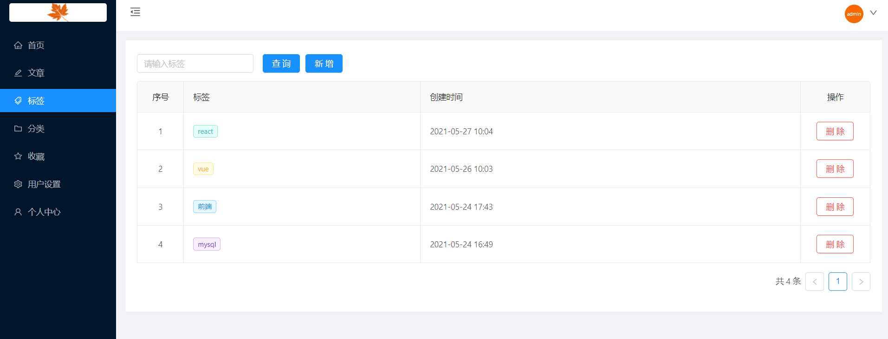

# koa+react

#### 介绍
koa+sequelize+react实现博客

前端是`blod_admin`目录

启动的话进行 `npm install` or `cnpm install` or `yarn install`

运行 `npm start`

打包`npm run build`

后台服务是`koa_blod`目录

启动进行`npm install` or `cnpm install` or `yarn install`

运行 `npm start`

#### 软件架构说明

前端采用的是`react+antd`实现的前后端页面一起的项目

后端才采用的是`koa+sequelize`框架实现的服务

#### 页面展示

1.  前端展示

    

2.  登录展示
	
3.  后台页面
	

